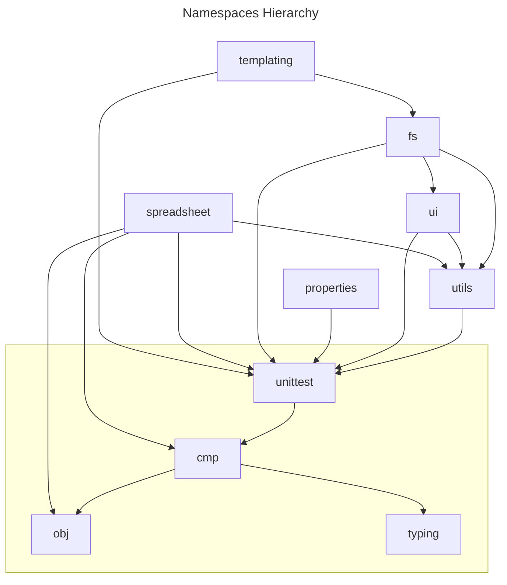

# Introduction

This repository contains different librairies that can be used within Google AppScript (gas) projects.
See [gas-projects-template](https://github.com/bjbfr/gas-projects-template) for a starter for such projects.

## Hierarchy

